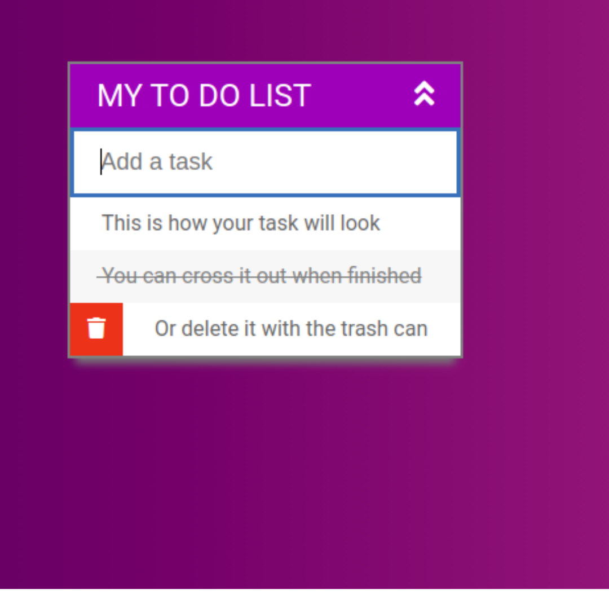

# To DO List
___

Vamos a crear nuestra propia aplicación para anotar tareas pendientes \(o la tradicional lista de supermercado\). Va a tener un input donde el usuario/a ingresa tareas para hacer, y al hacer enter se van a agregar a una lista abajo. Cuando clickeemos en las tareas se van a tachar \(tareas finalizadas\), y cada tarea va a tener un ícono para borrarlas de la lista. Vamos a ir paso a paso, empezando de cero y terminando con una aplicación completa y funcionando. Va a quedar pro ;\)

1. Organizar el directorio de la aplicación \(las carpetas donde vas a guardar los archivos\).
2. Crear el html básico.
3. Agregar funcionalidad:
   - Poder tachar las tareas que ya completamos.
   - Poder borrar ítems de la lista.
   - Agregar ítems a la lista.
4. Agregar estilo.
5. Iconos y retoques finales. 

Vista previa:

[El resultado finalk se puede ver acá](https://heuristic-tereshkova-10c64b.netlify.app/)