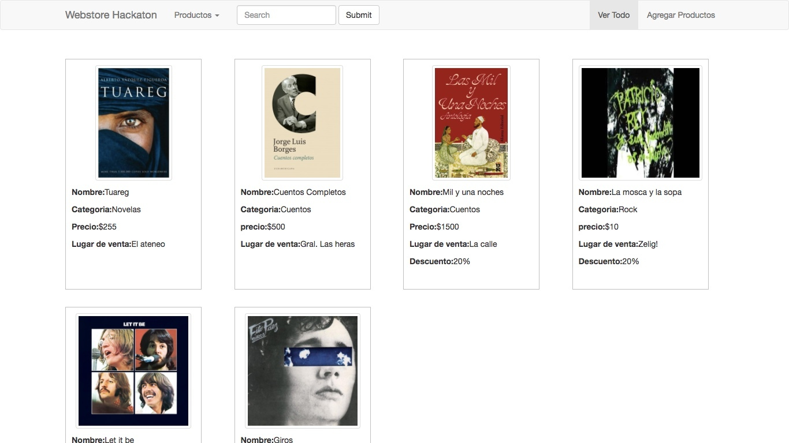
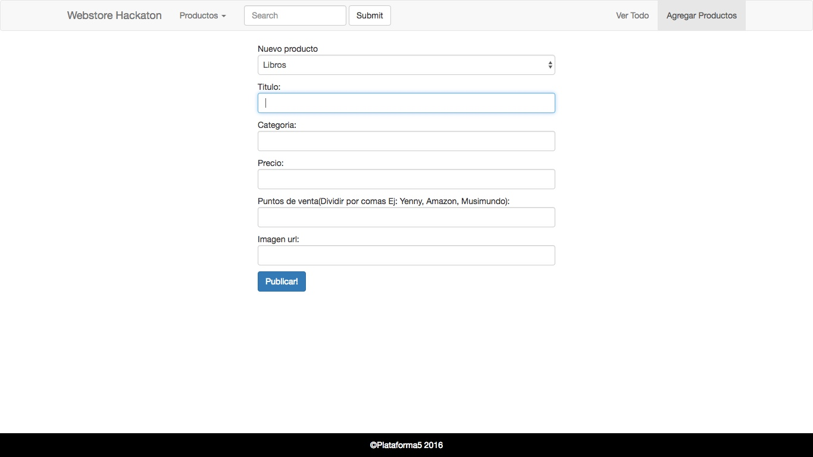
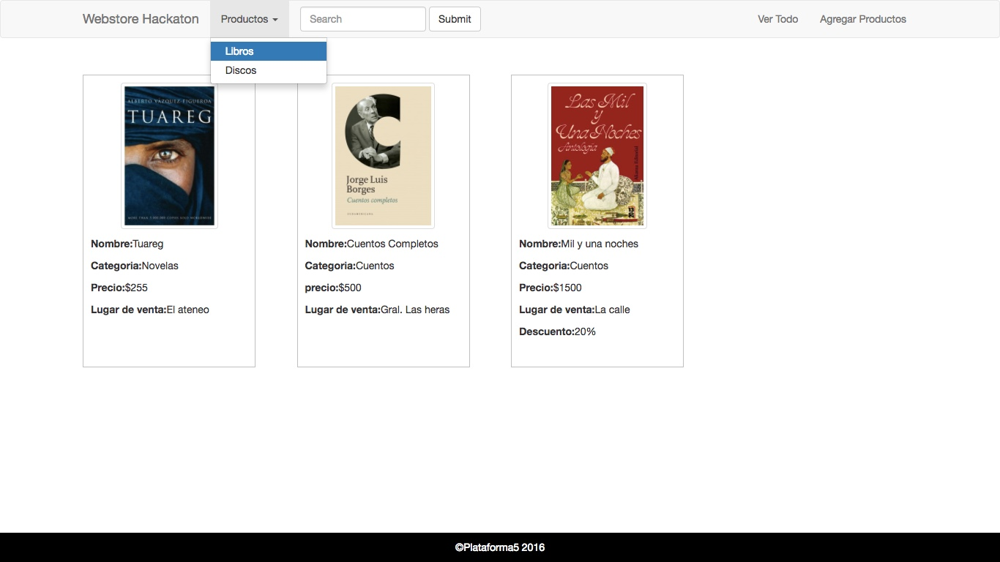
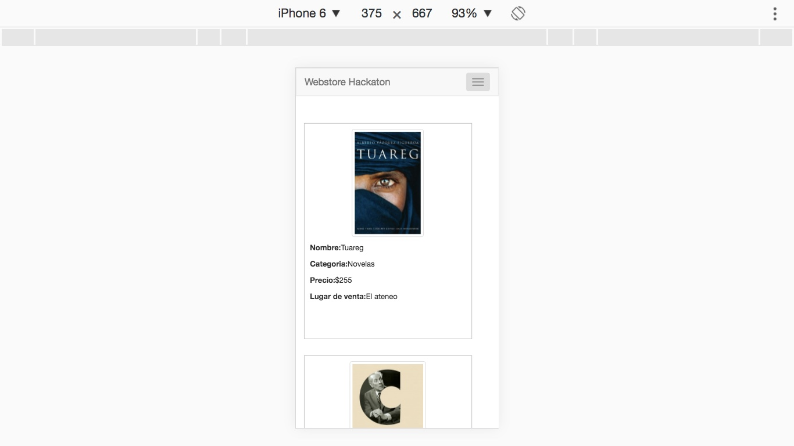
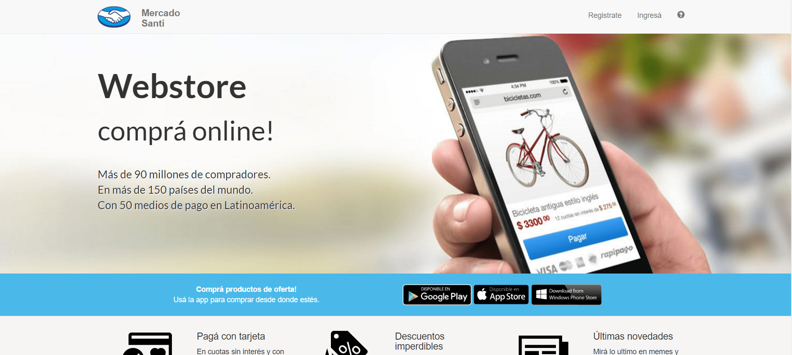
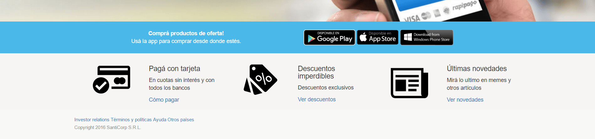

# Webstore Hackaton
___
Vamos a maquetar un sitio de e-commerce \(una "tienda web" o "webstore"\), basándonos en las imágenes que están más abajo. Para lograr esto vamos a utilizar gran parte de lo que aprendimos esta semana.

Vamos a utilizar Bootstrap en su versión 4 para hacer este sitio. Esto nos va a permitir codear más rápido y asegurar una base estética.

- Nuestro sitio va a tener cuatro páginas distintas. La primera va ser una página que muestre todos los productos, la segunda y la tercera van a ser páginas para ver sólo los libros y sólo los discos \(es básicamente la misma página que "ver todos los productos" pero en un caso borramos los libros y en otro los discos\), y la última será un formulario para agregar nuevos productos.

- Todas las vistas tendrán en común la barra de navegación \(navbar\) y el footer \(una sección chiquita al pie de la página con la marca\). Lo que cambiará en la navbar es qué elemento esta activo, dependiendo en que página estemos. Para esto vas a tener que mirar el código de la navbar de Bootstrap y descubrir la clase que hace negrita a un hipervinculo, indicando que esta es la sección activa.

- Tu sitio tiene que ser responsive, osea que se debe ajustar su contenido dependiendo el tamaño de la pantalla \(acordate de las col-sm-.., col-lg-.., etc\).

- A las págnas de un sitio se las llama "vistas". En adelante vamos a ir viendo las vistas que tiene que tener tu web store, que vas a tener que ir replicando en tu código a partir de las imágenes que te mostramos:
 1. "Ver todo": 
     
 2. "Agregar producto":
     
 3. "Categoría individual":
           
 4. "Versión Mobile":
     

- De acá podés sacar las imágenes de los productos:
     - [Tuareg](https://upload.wikimedia.org/wikipedia/en/f/f1/Tuareg_novel_-_bookcover.jpg)
     - [Cuentos Completos](https://imagessl9.casadellibro.com/a/l/t5/59/9788420667959.jpg)
     - [Las mil y una noche](https://contentv2.tap-commerce.com/cover/large/9789500738651_1.jpg?id_com=1113)
     - [Gulp](https://www.cmtv.com.ar/tapas-cd/redondosgulp.jpg)
     - [Let it be](https://ksassets.timeincuk.net/wp/uploads/sites/55/2015/01/2014TheBeatles_LetItBe_091214.jpg)
     - [Giros](https://upload.wikimedia.org/wikipedia/commons/thumb/1/1b/Giros_1985_Fito_Paez.jpg/250px-Giros_1985_Fito_Paez.jpg)

- Si terminaste lo anterior puedes agregarle una landing page \(página principal\) a tu sitio para recibir a los usuarios que llegan: 
    1. "Landing":
         
    2. "Footer":
              

- Imágenes para usar:
    - [Imagen de fondo:](https://userscontent2.emaze.com/images/6c3d184f-8912-4beb-bd73-861e9dbf21d1/b31b4c206aaf51c493ddf5c74283cfd3.jpg)
    - [Botón Google Play:](http://dungeonhunter5.com/public/images/badges/googleplay_ES.png)
    - [Botón App Store:](https://i.pinimg.com/originals/09/f6/3d/09f63d458e7a50364610224cb92df14c.png)
    - [Icono tarjeta de crédito:](https://d30y9cdsu7xlg0.cloudfront.net/png/29661-200.png)
    - [Icono de descuentos:](https://d30y9cdsu7xlg0.cloudfront.net/png/82811-200.png)
    - [Icono de novedades:](https://cdn2.iconfinder.com/data/icons/picol-vector/32/news-256.png)

___
[El resultado se puede ver acá](https://elastic-feynman-9cdfa8.netlify.app/)

